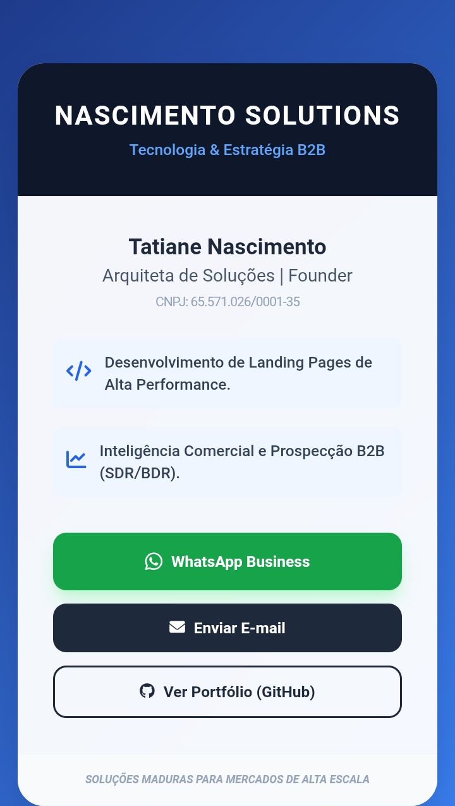
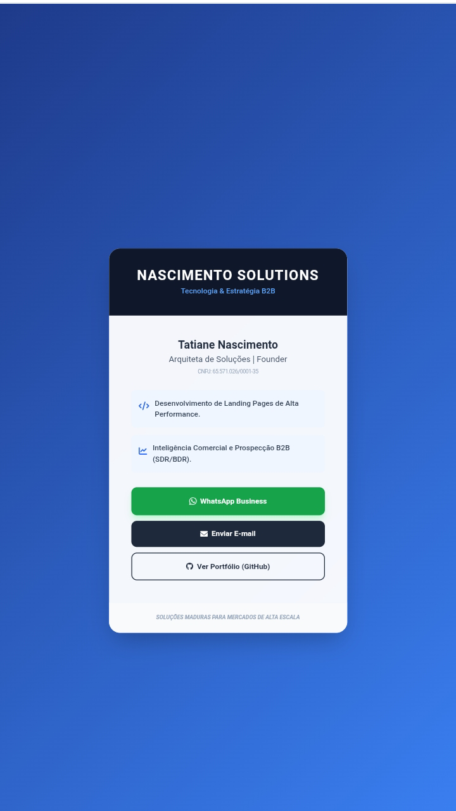
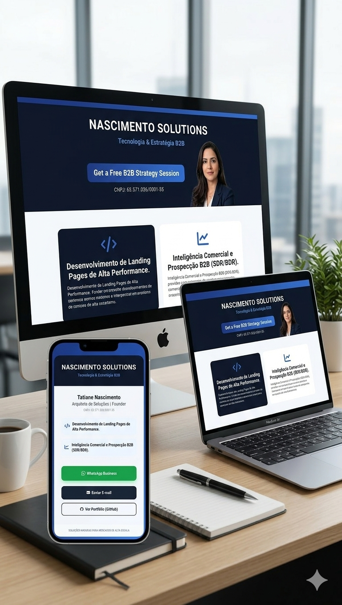

# nascimento-solutions-card
🚀 Cartão de Visitas Digital Interativo da Nascimento Solutions. Uma demonstração de arquitetura de soluções e front-end responsivo para apresentação profissional e prospecção B2B.
🚀 Nascimento Solutions - Cartão de Visitas Digital Interativo
​Onde a estratégia e a tecnologia se encontram para apresentar a sua autoridade no mercado B2B. Este repositório contém o código-fonte do Cartão de Visitas Digital Interativo da Nascimento Solutions, desenvolvido para ser uma ferramenta de prospecção rápida, elegante e de alta performance tecnológica.
​🔗 Ver Cartão Online (Live Demo)
​Acesse agora o link oficial:
👉 https://tatiane347.github.io/nascimento-solutions-card/
​📊 Sobre a Nascimento Solutions
​A Nascimento Solutions não é apenas uma consultoria; é o braço tecnológico para empresas que buscam escala exponencial. O Cartão Digital foi arquitetado para demonstrar na prática a capacidade de entrega técnica da Founder, unindo:
​Arquitetura de Soluções: Estrutura pensada para conversão imediata.
​Desenvolvimento Moderno: Código limpo e leve que carrega instantaneamente.
​Inteligência Comercial: Foco em facilitar o contato para reuniões qualificadas.
​🛠️ Tecnologias e Ferramentas
​Desenvolvido com foco em performance extrema e design responsivo (Mobile-First):
​HTML5 Profissional: Estrutura semântica focada em acessibilidade e clareza.
​Tailwind CSS: Estilização moderna com efeitos de Glassmorphism (vidro) e paleta Slate/Blue.
​Font Awesome: Ícones vetoriais para navegação intuitiva e visual premium.
​JavaScript: Lógica de automação de redirects para WhatsApp e logs de carregamento.
​Interatividade: Efeitos de hover e transições suaves otimizadas para toque no Samsung A10 e dispositivos móveis.
​✨ Diferenciais do Projeto
​🎯 Cartão de Visitas como Produto: Diferente de um PDF estático, o cartão é uma página web real, provando a habilidade de desenvolvimento da Arquiteta de Soluções.
​📱 Responsividade Total: Perfeito em qualquer tela — do smartphone compacto ao monitor desktop 4K.
​📩 Contact-First: Botão de WhatsApp Business integrado com mensagem pré-configurada para facilitar a abordagem do cliente.
​🛡️ Branding Profissional: Uso de Favicon personalizado (NS) e design alinhado a tomadas de decisão C-Level.
​⚡ Performance: Carregamento ultra-rápido, ideal para situações de rede 3G/4G durante reuniões externas.
​📬 Contacto e Conexões
​Este projeto faz parte do meu portfólio de Arquiteta de Soluções. Estou disponível para desenvolver infraestruturas digitais de alta conversão e colaborar em projetos estratégicos!
​LinkedIn: Acesse meu Perfil Profissional:https://www.linkedin.com/in/tatiane-nascimento-68b0622bb?utm_source=share&utm_campaign=share_via&utm_content=profile&utm_medium=android_app

​GitHub: Veja meus repositórios:https://github.com/tatiane347

​E-mail: nascimentosolutionstatiane@gmail.com

​💬 CONVERSAR NO WHATSAPP
​Fale diretamente com Tatiane Nascimento | Arquiteta de Soluções:
👉 Clique aqui para abrir o WhatsApp:Converse com Tatiane Souza/Dev & Business no WhatsApp: https://wa.me/5511910526709

​Desenvolvido com 💡 e visão estratégica por Tatiane Nascimento De Souza.

​<!-- Mockup Principal (Computador e Celular) -->

​

​

​<!-- Grid de Detalhes (Lado a Lado) -->

​

<table border="0">

<tr>

<td width="50%" align="center">

<b>Visualização Desktop</b>

</td>

<td width="50%" align="center">

<b>Visualização Mobile (Samsung A10)</b>

</td>

</tr>

</table>

